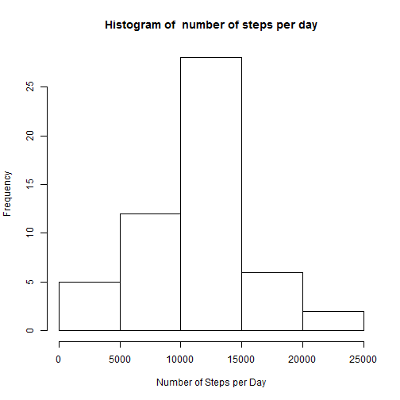
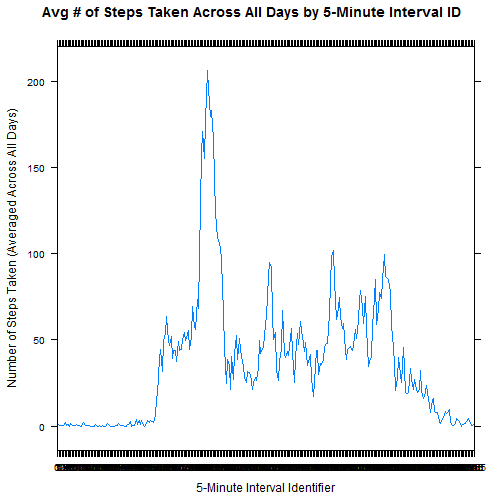
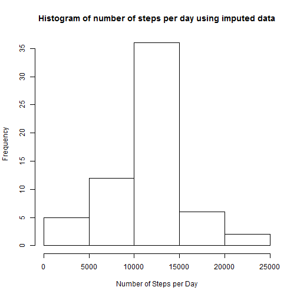
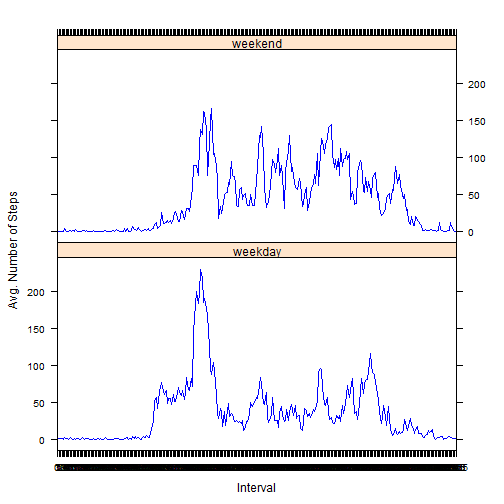

##Introduction
A personal activity monitoring device collected data at 5-minute intervals throughout the day for 2 months on an anonymous individual for the months of October and November, 2012, and included the number of steps taken in 5 minute intervals each day.

Our goal is to use this data to answer the questions in the assignment. 

#Loading and preprocessing the data


```r
#If the data is not already in your current working directory
if(!file.exists("./personal_activity_data.zip")){
  #Download the file into your current working directory
  #NOTE: The data used in this analysis was downloaded from this URL on 1-9-16 at 11:40AM CST.
  download.file("https://d396qusza40orc.cloudfront.net/repdata%2Fdata%2Factivity.zip",
              destfile="./personal_activity_data.zip")
  
  #Unzip the file into a directory called activity_data in your current working directory
  unzip("./personal_activity_data.zip",
        exdir="./activity_data")
  
}


#Load the file from the activity_data folder
activity_data <- read.csv(file="./activity_data/activity.csv",
                          header=TRUE,
                          stringsAsFactors=FALSE,
                          na.strings="NA",
                          colClasses=c("numeric",
                                       "character",
                                       "numeric"))

#Convert the date column to a date data type.
activity_data$date <- as.Date(activity_data$date)

#Convert the interval column to a factor.
activity_data$interval <- as.factor(activity_data$interval)
```

#What is the mean total number of steps taken per day?

```r
#First we calculate the number of steps taken per day, ignoring missing values (default of aggregate function)
steps_per_day <- aggregate(steps ~ date, data=activity_data, FUN="sum")
```
Next we generated a histogram of the number of steps taken each day.


```r
hist(steps_per_day$steps,
     freq=TRUE,
     main=paste("Histogram of ", "number of steps per day"),
     xlab="Number of Steps per Day",
     ylab="Frequency")
```

 

Next we calculated the mean of the total number of steps taken per day, which turned out to be 10,766.19 steps/day.

```r
mean_steps <- mean(steps_per_day$steps, na.rm=TRUE)
mean_steps
```

```
## [1] 10766.19
```

Next we calculated the median of the total number of steps taken per day, which turned out to be 10,765 steps/day.

```r
median_steps <- median(steps_per_day$steps, na.rm=TRUE)
median_steps
```

```
## [1] 10765
```
#What is the average daily activity pattern?

Let's generate a time series plot of the 5-minute interval (x-axis) and the average number of steps taken, averaged across all days (y-axis).

```r
#Calculate the average number of steps taken averaged across all days by the 5-minute interval identifier.

average_steps_per_interval <- aggregate(steps ~ interval, data=activity_data, FUN="mean")


#Generate a time-series line graph (type="l") of the average # of steps taken 
#averaged across all days by 5-minute interval
library(lattice)
xyplot(steps ~ interval, data=average_steps_per_interval, type="l",
       xlab="5-Minute Interval Identifier",
       ylab="Number of Steps Taken (Averaged Across All Days)",
       main="Avg # of Steps Taken Across All Days by 5-Minute Interval ID")
```

 

Which 5-minute interval identifier, on average across all the days in the dataset, contains the maximum number of steps?

The answer is the 835 minute interval identifier is the day which contains the maximum number of steps averaged across all the days in the dataset, with that max being 

```r
#First calculate the 5-min. interval identifier which has the max # of steps averaged across all days in the data set.
average_steps_per_interval$interval[which(average_steps_per_interval$steps==max(average_steps_per_interval$steps))]
```

```
## [1] 835
## 288 Levels: 0 5 10 15 20 25 30 35 40 45 50 55 100 105 110 115 120 ... 2355
```

```r
#What is the max number of steps for this 5-minute interval identifier?
average_steps_per_interval$steps[which(average_steps_per_interval$steps==max(average_steps_per_interval$steps))]
```

```
## [1] 206.1698
```
#Imputing missing values
There are a number of days/intervals where there are missing values (coded as NA).
The presence of missing days may introduce bias into some calculations or summaries of the data.

First, let's calculate the total number of missing values in the data set (i.e. the total number of rows with NAs).


```r
#The steps column of activity_data has 2,304 NAs.
sum(is.na(activity_data$steps))
```

```
## [1] 2304
```

```r
#The date column of activity_data has 0 NAs.
sum(is.na(activity_data$date))
```

```
## [1] 0
```

```r
#The interval column of activity_data has 0 NAs.
sum(is.na(activity_data$interval))
```

```
## [1] 0
```
So we conclude there are 2,304 NAs in the data set.
Now we want to impute the missing values in the data set by using the mean for that 5 minute interval.


```r
#Let's create a copy of activity_data in which we will fill in the missing values with estimates.
activity_data_copy <- activity_data

#Let's loop through activity_data_copy and impute the NAs in the steps column
#by using the mean for that 5 minute interval.
for(i in 1:nrow(activity_data_copy)){
  #Define the value of steps of the current row
  current_steps_value <- activity_data_copy$steps[i]
  
  #Define the 5-minute interval ID of the current row
  current_interval_id <- activity_data_copy$interval[i]
  
  #If current_steps_value is NA
  if(is.na(current_steps_value)){
    #Then calculate the mean for the associated 5 minute interval
    mean_for_this_5_minute_interval <- average_steps_per_interval$steps[which(average_steps_per_interval$interval==current_interval_id)]
      
    #Use this to replace the NA for steps in the current row
    activity_data_copy$steps[i]<- mean_for_this_5_minute_interval
      
  }
  
}
```
Now we generate a histogram of the total number of steps taken each day and calculate and report the mean and median total number of steps taken per day using this new, imputed data set.

```r
steps_per_day_using_imputed_data <- aggregate(steps ~ date, data=activity_data_copy, FUN="sum")

#Generate the histogram of number of steps taken each day using the imputed data
hist(steps_per_day_using_imputed_data$steps,
     freq=TRUE,
     main=("Histogram of number of steps per day using imputed data"),
     xlab="Number of Steps per Day",
     ylab="Frequency")
```

 

```r
#Calculate the mean of number of steps taken per day
imputed_mean_steps <- mean(steps_per_day_using_imputed_data$steps)
imputed_mean_steps
```

```
## [1] 10766.19
```

```r
#Calculate the median of number of steps taken per day
imputed_median_steps <- median(steps_per_day_using_imputed_data$steps)
imputed_median_steps
```

```
## [1] 10766.19
```
What is the impact of imputation on the mean steps per day and the median steps per day?

```r
#Calculate the difference in the mean steps per day and imputed mean steps per day
difference_in_mean <- mean_steps - imputed_mean_steps
difference_in_mean
```

```
## [1] 0
```

```r
#Calculate the difference in the median steps per day and imputed median steps per day
difference_in_median <- median_steps - imputed_median_steps
difference_in_median 
```

```
## [1] -1.188679
```
In the case of the mean, it actually didn't change at all after imputation.  Before imputation, the mean was 10,766.19 steps per day, and after imputation, it was still 10,766.19 steps per day.

However, in the case of the median, there is a small change.  Before imputation, the median was 10,765 steps per day, and after imputation, it increased to 10,766.19 steps per day, a decrease of 1.19 steps.

Overall, the impact of imputing missing data was fairly negligible, because the mean and median changed very little due to imputation.

#Are there difference in activity patterns between weekdays and weekends?

In this section, we will analyze the data with the filled-in missing values.

```r
#First, add a factor variable to activity_data_copy that says what day of the week each date is.
activity_data_copy$day_of_the_week <- weekdays(activity_data_copy$date)

#Add a new factor variable to activity_data_copy that says if this date is a "weekday" or a "weekend" by looping through each row of activity_data_copy.
activity_data_copy$day_type <- 'Unknown'

for(j in 1:nrow(activity_data_copy)){
  #Define current day of the week
  curr_dow <- activity_data_copy$day_of_the_week[j]
  #If the current date is a weekday, define day_type as a "weekday"
  if(curr_dow %in% c("Monday", "Tuesday", 'Wednesday', 'Thursday', 'Friday')){
    activity_data_copy$day_type[j] <- 'weekday'
  }
  #If the current date is a weekend, define day_type as a "weekend"
  if(curr_dow %in% c('Saturday', 'Sunday')){
    activity_data_copy$day_type[j]<-'weekend'
  }
}

#Make the day_type column a factor variable
activity_data_copy$day_type <- as.factor(activity_data_copy$day_type)

#Calculate average steps per interval on the imputed data by weekday and weekend.
avg_steps_per_interval_by_day_type <- aggregate(steps ~ interval + day_type, 
                                    data=activity_data_copy,
                                    FUN="mean")


#Generate a panel plot containing a time series plot (type="l")
#of the 5-minute interval (x-axis)
#and the average number of steps taken, averaged across all weekday days or weekend days
xyplot(avg_steps_per_interval_by_day_type$steps ~ avg_steps_per_interval_by_day_type$interval | avg_steps_per_interval_by_day_type$day_type,
       type="l",
       col="blue",
       layout=c(1,2),
       xlab="Interval",
       ylab="Avg. Number of Steps")
```

 
